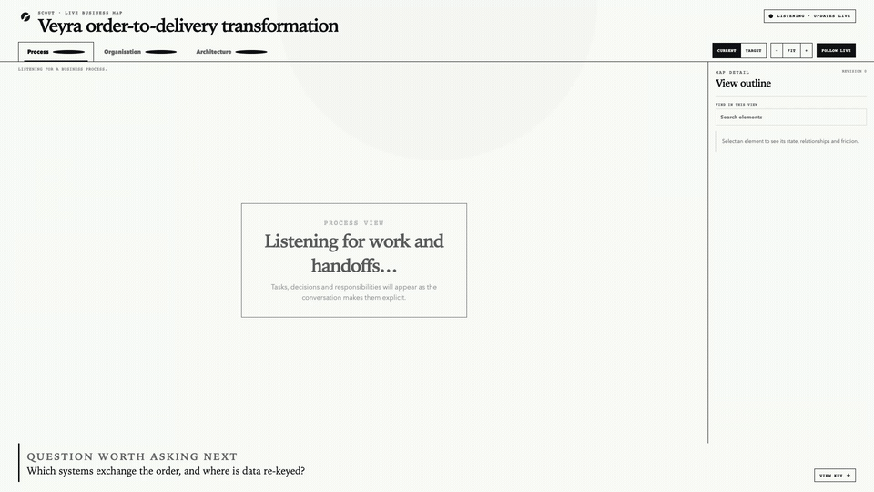

# Scout v2

<p align="center">
  
</p>

> **Builders, the gap is your market.**
>
> **$581.7B** went into AI in 2025. Only **6%** of surveyed organizations were
> getting serious enterprise-level value from it.

Scout finds what matters in a live customer conversation. Codex turns that
approved context into working software.

## Live multi-view mapping

<p align="center">
  
</p>

Scout continuously separates one conversation into three evidence-backed views:
the business process, the organisation that owns it, and the architecture that
supports it. Each tab retains its last valid diagram while the next revision is
rendered and checked. Current and target states remain distinct, so discovery
can move from “how it works today” to “what we should build” without mixing the
two models.

The animation is a real-time rehearsal through the compiled server, SSE stream,
semantic projections, Mermaid renderer, layout fallbacks, and geometry gates.
Recall and Codex are replaced only at their external boundaries by deterministic
test adapters; no browser graph or SVG is injected.

## The one-minute deck

**[Open the Scout market vision presentation →](Presentation/index.html)**

The five-slide HTML deck is self-contained and built for a one-minute pitch.
Use `→` to reveal each storytelling beat, `←` to reverse it, and `N` to open the
speaker notes. See [the presentation guide](Presentation/README.md) for pacing
and the complete controls.

## The gap

AI projects rarely fail because builders cannot build. They fail because the
customer's meaning gets diluted before the build begins:

```text
Customer call → Notes → Deck → Ticket → Build → “That's not what I wanted.”
```

Every handoff looks reasonable. Together, they separate the implementation
from the customer's original problem.

Scout closes that gap. It listens with explicit consent, keeps evidence tied to
attributed customer language, and gives people control over what becomes the
accepted model of the business.

```text
Conversation → Right problem → Human approval → Codex builds
```

**Scout finds the signal. Codex powers the build.**

The hackathon MVP proves the context path through the accepted live business
graph. The deck shows the larger product vision: using that human-approved
reality as the foundation for a Codex build.

The market figures are independent signals, not a single ROI calculation.
[Stanford HAI](https://hai.stanford.edu/news/inside-the-ai-index-12-takeaways-from-the-2026-report)
reports $581.7B in global corporate AI investment during 2025.
[McKinsey](https://www.mckinsey.com/capabilities/quantumblack/our-insights/the-state-of-ai)
classifies about 6% of its survey respondents as AI high performers: organizations
reporting both significant AI value and at least 5% enterprise-level EBIT impact.

## How Scout works

Scout joins a live Zoom, Google Meet, or Teams call and receives
speaker-attributed finalized transcript events from Recall.ai. For each meeting:

1. Recall provides only finalized, attributed utterances for analysis.
2. Scout maintains one persistent Codex app-server thread.
3. Codex receives the accepted graph plus only the new finalized utterances.
4. Codex returns a complete `BusinessGraph`; Scout validates and atomically
   accepts it as the next revision.
5. The browser receives the revision over SSE, independently projects Process,
   Organisation, and Architecture views, then completely rerenders each Mermaid
   diagram while keeping its previous SVG visible until the replacement passes.

The hackathon MVP deliberately uses a full `BusinessGraph` snapshot per analysis
turn. The browser replaces the previous graph and rerenders Mermaid rather than
trying to merge incremental graph patches.

### Diagram reliability model

- The model returns business semantics, never Mermaid syntax or coordinates.
- Stable graph IDs preserve identity between complete revisions.
- Process, organisation, and architecture compilers apply diagram-specific
  shapes, relationships, containment, and layout profiles.
- The active tab renders first; inactive views update during idle time.
- Candidate layouts fail closed when semantic edges disappear, nodes overlap,
  edges cross nodes or titles, labels clip, or required entities cannot be
  measured.
- A failed candidate automatically falls back to another deterministic profile.
  If all profiles fail, Scout keeps the last readable SVG.

The implemented design, quality gate, and longer-term renderer evaluation are
indexed in [the diagram engineering notes](docs/research/README.md).

## Surfaces

- `/operator/:sessionId` — attributed transcript, participants, integration
  health, revision state, suggested follow-up, and manual analysis control.
- `/whiteboard/:whiteboardId` — presentation-safe multi-view map for screen
  sharing. The opaque public ID is returned when the session is created.
- `/events/:sessionId` — full operator session snapshots over SSE.
- `/events/whiteboards/:whiteboardId` — presentation-safe whiteboard projections
  over SSE, without transcript or integration internals.

On the operator page, the builder selects **This is me** beside their Recall
meeting identity. Scout stores that participant as the operator, treats the
other human participants as clients, excludes the Live Architect bot from the
selector, and includes the resolved role with each utterance sent for analysis.
The selection can be corrected during the session. A correction invalidates the
old graph and Codex thread, preserves the finalized transcript, and rebuilds a
complete graph from that evidence under the corrected roles.

## Requirements

- Node.js 22.23.1 and npm 10.9.8 (pinned by `.node-version` and `package.json`)
- A locally authenticated `codex` CLI with `codex app-server` support
- A Recall.ai API key and workspace verification secret
- A stable public HTTPS URL forwarding to this server

Recall must send dashboard bot-status webhooks to:

```text
https://YOUR_PUBLIC_HOST/webhooks/recall/status
```

The per-session real-time webhook URL is generated automatically when a bot is
created.

## Configuration

```bash
npm ci
cp .env.example .env
```

Fill in:

```text
PUBLIC_API_BASE_URL=https://YOUR_PUBLIC_HOST
RECALL_REGION=us-west-2
RECALL_API_KEY=...
RECALL_WORKSPACE_VERIFICATION_SECRET=...
```

Current Recall workspaces use `RECALL_WORKSPACE_VERIFICATION_SECRET` for both
real-time and dashboard webhooks. Set `RECALL_SVIX_WEBHOOK_SECRET` only when an
older dashboard webhook was explicitly provisioned with a separate legacy Svix
secret. Keep all secrets outside git; for the hackathon, store them in 1Password
Agent Env.

Load the environment and start the service:

```bash
set -a
source .env
set +a
npm run dev
```

Automatic analysis uses leading-edge batching: the first finalized utterance
starts a non-resetting `ANALYSIS_DELAY_MS` timer (8 seconds by default).
Additional finals join that pending batch without postponing it. If more finals
arrive while Codex is analyzing, the next pass starts after the shorter,
non-resetting `ANALYSIS_RERUN_DELAY_MS` interval (2 seconds by default). Batches
are bounded by both utterance count and serialized text bytes. The
operator's **Analyze now** action bypasses an idle timer immediately.

## Runtime readiness

- `/livez` reports whether the HTTP process is accepting traffic.
- `/readyz` verifies that the selected live or rehearsal mode is usable and
  preflights Codex and Recall.
- `/health` is a compatibility alias for `/readyz`.

Live session creation returns `503` without allocating a session when required
dependencies are unavailable. It returns `201` only after Recall accepts bot
creation. See [the operations runbook](ops/README.md) for the supported
single-replica deployment and graceful shutdown procedure.

The operator transcript also displays Recall's interim
`transcript.partial_data` while someone is speaking. Interim text is replaced
by the finalized utterance and is never sent to Codex for analysis.

## Live processing pause

The operator can pause and continue live processing without ending the meeting
or replacing the Recall bot, transcript, graph, or Codex thread. When an active
Recall bot is available, Scout uses Recall's pause/resume recording endpoints;
Recall also halts real-time transcription while recording is paused. Scout
keeps a server-side gate as a race and fallback boundary.

Transcript events received while paused are intentionally discarded and are not
buffered or replayed after continuing. Participant and bot-status events still
update the session. A Codex analysis already running may finish, but no new
automatic or manual analysis starts until live processing continues.

## Start a live session

Create a session with the real meeting URL:

```bash
curl -X POST http://127.0.0.1:3000/api/sessions \
  -H 'content-type: application/json' \
  --data '{"meetingUrl":"https://meet.google.com/xxx-yyyy-zzz"}'
```

The response contains the `operatorUrl` and `whiteboardUrl`. Admit the Scout bot
when it appears in the call, then share the whiteboard URL in a browser window.

## No-Recall rehearsal

The development ingest route makes the full Codex and UI loop demoable before
Recall credentials are ready:

```text
SCOUT_ALLOW_DEV_INGEST=true
```

Create a session as above, then provide both the builder and customer identities.
The first finalized item can be the builder's question:

```bash
curl -X POST \
  http://127.0.0.1:3000/api/dev/sessions/SESSION_ID/utterances \
  -H 'content-type: application/json' \
  --data '{
    "id":"demo-operator-1",
    "sequence":1,
    "participantId":"builder-1",
    "participantName":"Scout operator",
    "text":"How does the lead handoff work today?",
    "startedAt":1,
    "endedAt":5,
    "finalized":true
  }'
```

Then send the customer's finalized answer:

```bash
curl -X POST \
  http://127.0.0.1:3000/api/dev/sessions/SESSION_ID/utterances \
  -H 'content-type: application/json' \
  --data '{
    "id":"demo-1",
    "sequence":2,
    "participantId":"ceo-1",
    "participantName":"Maya, CEO",
    "text":"Sales exports leads from HubSpot to a spreadsheet, then Finance manually copies them into NetSuite.",
    "startedAt":6,
    "endedAt":21,
    "finalized":true
  }'
```

Select the builder as operator. Scout assigns the other human identity as the
customer and safely replays the pending finals:

```bash
curl -X PUT \
  http://127.0.0.1:3000/api/sessions/SESSION_ID/operator \
  -H 'content-type: application/json' \
  --data '{"participantId":"builder-1"}'
```

Analysis then runs after the bounded leading-edge delay, or immediately with:

```bash
curl -X POST http://127.0.0.1:3000/api/sessions/SESSION_ID/analyze
```

## Verification

```bash
npm test
npm run typecheck
npm run build
git diff --check
```

`npm run check` runs the same local sequence. CI also starts the built artifact
and exercises `/livez` before accepting a change.

The 278-test suite covers snapshot coordination, runtime routing, Recall
normalization and signature checks, Codex JSON-RPC/structured output handling,
session storage, canonical multi-view graph semantics, deterministic Mermaid
compilation, geometry gates, render supersession, focus restoration, role
correction, dependency failure recovery, SSE draining, and terminal meeting
interleavings.
