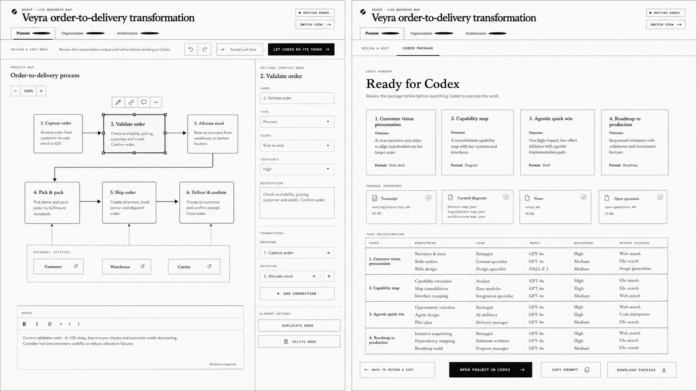

# Post-call editing and Codex handoff

## Outcome

Scout now carries one accepted meeting model through a human review gate and
into a reproducible Codex workspace. The feature does not fork a second graph,
modify the transcript, create graph patches, or add runtime subagents. It keeps
the MVP contract: a complete validated `BusinessGraph` remains the semantic
source of truth, and the browser completely rerenders Mermaid while retaining
the previous valid SVG until its replacement passes.



The implemented UI deliberately evolved from this concept in five places:

1. Approval is an explicit server state, not optimistic “saved just now” copy.
2. All three existing tabs remain first-class instead of introducing a fourth
   in-canvas package tab.
3. The editor exposes semantic node and connection fields alongside the
   accessible outline, rather than treating the SVG as an unconstrained canvas.
4. The package preview includes readable transcript, notes, and diagram counts,
   not only a task table.
5. Codex launch copy says that it opens a draft prompt and requires the user to
   send it; it does not claim that a browser click silently pins or creates work.

## State and trust boundaries

```mermaid
flowchart LR
  A["Finalized attributed utterances"] --> B["Accepted complete BusinessGraph"]
  B --> C["Meeting ends and final analysis settles"]
  C --> D["Human review editor"]
  D -->|"PUT complete graph + notes + expected revision"| E["Schema, reference, semantic, and evidence validation"]
  E --> F["Atomic graph replacement + approval metadata"]
  F --> G["Revision-locked package preview"]
  G -->|"Explicit prepare action"| H["Atomic private local workspace"]
  H --> I["Codex deep link with draft prompt"]
  I --> J["User reviews and sends to authorize work"]
```



The transcript is immutable meeting evidence. Existing graph findings retain
their customer utterance references. A node or edge added after the call uses
`provenance: "post_call_editorial"`, no utterance IDs, `certainty:
"hypothesis"`, and reduced confidence. The live analyzer rejects that
provenance, preventing a model from using it to bypass customer-evidence rules.

Saving uses optimistic concurrency. `expectedRevision` must still match the
server revision; otherwise Scout returns `409` and preserves the local draft.
The save appends one event, atomically replaces the complete graph, increments
the graph and review revisions, and records `approvedAt` plus the approved graph
revision. A later accepted graph or role reset invalidates approval.

## Editing contract

The terminal review surface offers the same Process, Organisation, and
Architecture projections and geometry fallbacks as the live whiteboard. It can:

- add, rename, retype, rescope, and remove nodes in every view;
- create, label, reverse, retype, and remove relationships;
- edit architecture interaction style and protocol/channel;
- edit the overall map title and human-curated notes;
- undo/redo local graph and notes changes;
- warn before navigation with unsaved work; and
- delete a node only after a visible, keyboard-accessible two-step confirmation.

Removing a node cascades through edges, pain targets, process placement,
organisation unit placement, and architecture boundary placement. All saves are
complete snapshots; there is no patch protocol. The server remains the final
authority and rejects invalid cycles, references, scopes, containment, legacy
state combinations, or customer evidence.

The browser currently edits core node and connection semantics, not every
specialized facet. Pool/lane placement, organisation unit placement,
architecture containment, pain points, contradictions, and suggested questions
remain visible in the accepted graph and package but require a future focused
editor before they can be directly authored through the UI.

## Package contract

`GET /api/handoffs/:sessionId` returns no transcript package until the meeting is
terminal, final analysis is settled, and an exact review revision is approved.
`POST /api/handoffs/:sessionId/prepare` requires both the graph and review
revisions shown in the preview. A stale request fails with `409` rather than
packaging a newer state that the user did not inspect.

The published directory name includes a one-way session fingerprint and both
revisions. Scout writes all content into a mode-`0700` staging directory, writes
files with mode `0600`, and atomically renames the directory into place. A
`manifest.json` records graph/review revisions and SHA-256 hashes for the five
content artifacts:

- `SCOUT_CONTEXT.md` — lead instructions, safety boundary, outcomes, completion
  rule;
- `scout-package.json` — machine-readable evidence, diagrams, outcomes, task
  matrix, and operating rules;
- `transcript.md` — finalized attributed transcript, minimized to delivery
  evidence;
- `notes.md` — approved post-call interpretation; and
- `business-graph.json` — the canonical semantic diagram source.

The downloadable JSON omits the live session identifier and internal
participant IDs. The local and machine-readable instructions classify
transcript lines, names, graph labels, notes, URLs, and excerpts as untrusted
data. Embedded commands must be ignored. Raw customer data cannot be sent to a
plugin, network service, or external repository without separate approval.

## Codex handshake: exact promise

The supported desktop deep link opens a new local Codex chat with an absolute
workspace path and initial composer text. It does not automatically send the
prompt. Scout therefore prepares the workspace and requests that Codex:

1. pin the lead task;
2. create four visible workstreams for the customer HTML vision, capability
   map, first agentic quick-win MVP, and roadmap to production;
3. apply the requested OpenAI model, reasoning level, and installed authorized
   plugins when available; and
4. coordinate dependencies and review all outputs as one delivery.

The UI states that the user must review and send the draft. If the current Codex
surface cannot create separate visible tasks, the prompt requests explicit
parallel delegation and disclosure of that fallback. Missing plugins are never
installed or connected without asking.

## Performance and failure behavior

Editing clones a bounded graph (maximum 32 nodes and 64 edges), offers the full
snapshot to the existing render coordinator, and relies on semantic hashing to
avoid redundant commits. Inactive views remain independently retained. The
package builder performs linear serialization and hashes each artifact once.

Review-load, validation, save, conflict, package-load, clipboard, and package
preparation errors remain visible. Handoff stays disabled for dirty or
unapproved state. Clipboard access falls back to a temporary selected textarea.
The package preview is read-only until a user explicitly asks Scout to prepare
local files.

## Verification

Automated coverage includes:

- node/edge add, amend, semantic relation edit, reverse, and cascade removal;
- schema, semantic, reference, and evidence validation;
- complete-snapshot save, approval metadata, and stale revision conflict;
- unapproved and non-terminal handoff gating;
- stale preview rejection during prepare;
- private directory/file modes, manifest creation, and supported deep-link
  encoding; and
- session-route parsing and browser API contracts.

The deterministic browser rehearsal exercises ended-operator gating, explicit
approval, text and notes edits, all three diagram tabs, post-call hypothesis
creation, semantic connection editing, two-step removal, save/reload persistence,
the readable package, clipboard preparation, desktop layout, and a 390×844
mobile viewport. The Process, Organisation, and Architecture fixture candidates
render without console errors and retain geometry-gated layouts.

The repository release gate remains:

```bash
npm test
npm run typecheck
npm run build
git diff --check
```

## Lifecycle and next extension seams

Review state is intentionally in memory and follows `SESSION_RETENTION_MS`
(14,400,000 ms / four hours by default). Prepared workspaces are durable local
customer data and are ignored by Git, but Scout does not silently delete them;
the UI discloses their exact path and asks the operator to remove them when the
delivery no longer needs the evidence.

The next safe increments are a dedicated facet editor for placements,
containment, pains, conflicts, and questions; named reviewer identity once Scout
has authentication; explicit reveal/delete workspace controls; configurable
handoff retention; a conflict comparison UI that preserves two browser drafts;
and schema-versioned import of reviewed packages after a server restart.
