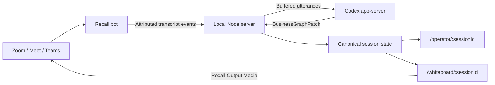
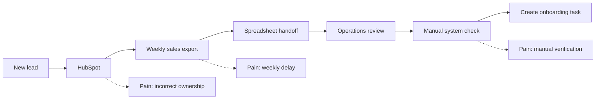

# Live Architect — Base PRD

**Version:** 0.1
**Status:** Working draft
**Date:** 18 July 2026
**Build constraint:** Hackathon MVP demonstrable in under three hours

## 1. Product summary

Live Architect is a conversation-aware smart whiteboard for stakeholder discovery calls.

A builder, consultant, forward-deployed engineer, or solutions architect interviews a business stakeholder such as a CEO or CTO. The stakeholder speaks naturally about their business, workflows, frustrations, systems, handoffs, and desired outcomes. A visible meeting participant called **Live Architect** listens to the conversation and continuously turns it into an evidence-backed visual model of how the business operates.

The key product moment is:

> A messy stakeholder explanation visibly crystallizes into a shared workflow diagram while the conversation is still happening.

Live Architect is not primarily a transcription or meeting-notes product. The transcript is an evidence stream used to construct and refine an operating model.

## 2. Problem

Discovery conversations contain valuable operational knowledge, but that knowledge is:

- Unstructured and spread across anecdotes, complaints, assumptions, and side topics.
- Difficult to convert into an accurate systems or workflow map while facilitating the call.
- Frequently misunderstood because stakeholders omit steps they consider obvious.
- Expensive to reconstruct after the meeting.
- Vulnerable to consultant interpretation being mistaken for stakeholder fact.

Existing meeting assistants typically produce transcripts, summaries, and action items. They do not visibly construct a shared model that the stakeholder can inspect and correct during the conversation.

## 3. Target user

### Primary user

A technical builder conducting stakeholder discovery:

- Forward-deployed engineer
- Solutions architect
- Technical consultant
- Product engineer
- Automation consultant
- Founder performing customer discovery

### Secondary participant

A stakeholder who understands part or all of the target business:

- CEO or founder
- CTO
- Operations leader
- Functional lead
- Subject-matter expert

## 4. Job to be done

When I interview a stakeholder about a messy business problem, help me turn their explanation into a shared, correctable model of the current operation so that I can identify missing information, expose bottlenecks, and propose a credible target workflow without losing the conversational flow.

## 5. Locked MVP decisions

- Meeting capture and participant attribution: **Recall.ai**
- Builder surface: **`/operator/:sessionId`**
- Meeting canvas: **`/whiteboard/:sessionId`**
- Reasoning runtime: **Codex app-server**
- App architecture: **TypeScript web application with a local Node server**
- Diagram renderer: **Mermaid**
- One Codex thread per meeting
- Recall bot joins as a visible participant named **Live Architect**
- Recall Output Media streams the whiteboard webpage through screenshare
- Camera output is the fallback if screenshare permission fails
- Recall separate-stream diarization is enabled when available
- The application, not Codex, owns the canonical business graph
- Codex returns structured graph patches grounded in transcript evidence

## 6. Product principles

### 6.1 Evidence before inference

Every meaningful node, edge, pain point, and desired outcome should reference one or more transcript utterances.

### 6.2 Current state and proposed future state must not blur

The product must visibly distinguish:

- Explicitly stated current state
- Explicitly stated desired state
- Codex-inferred hypothesis
- Unknown or contradictory information

### 6.3 The diagram should aid the conversation

Updates should occur after complete thoughts, not every token. The canvas must remain understandable and visually stable.

### 6.4 The builder remains in control

The operator can inspect evidence and reject or correct an inferred graph element. The MVP may limit editing, but it must not present uncertain inference as unquestionable truth.

### 6.5 Real runtime state only

Meeting status, transcript events, Codex status, graph changes, and participant identities must originate from the real integrations. Demo fixtures must be isolated from the live path.

## 7. Primary user journey

1. Builder opens `/operator/new`.
2. Builder pastes a Zoom, Google Meet, or Microsoft Teams URL.
3. Builder selects **Start Live Architect**.
4. The server creates a session and sends a Recall bot into the meeting.
5. The host admits **Live Architect**.
6. Recall starts attributed real-time transcription and shares `/whiteboard/:sessionId`.
7. The whiteboard initially displays **Listening and mapping your business…**
8. Participants introduce themselves.
9. The operator shows participant names and the live transcript.
10. Finalized utterances are buffered into analysis batches.
11. Codex updates the business graph through structured operations.
12. The whiteboard animates new actors, systems, processes, relationships, and pain points into view.
13. Codex identifies the highest-value missing relationship and suggests a follow-up question in the operator.
14. The builder asks that question.
15. New evidence completes or corrects the workflow.
16. The builder optionally reveals a proposed future-state layer.
17. When the meeting ends, Codex produces a final current-state graph, key unknowns, and candidate opportunities.

## 8. System architecture



### 8.1 Local Node server

The server owns:

- Session creation
- Recall API calls and webhook handling
- Codex app-server child process and JSON-RPC transport
- Transcript buffering
- Canonical graph state
- Codex turn queue
- WebSocket or Server-Sent Events fan-out
- Operator actions
- Whiteboard updates

### 8.2 Public connectivity

For the hackathon, a Cloudflare Tunnel or ngrok URL exposes:

- Recall webhook endpoint
- Whiteboard route loaded by Recall Output Media
- Operator route if required

Session URLs must contain an unguessable session token. API secrets must remain server-side.

## 9. Required routes and endpoints

### User-facing routes

#### `GET /operator/:sessionId`

Builder control room containing:

- Meeting and integration status
- Live attributed transcript
- Participant list
- Current topic
- Suggested follow-up question
- Evidence inspector
- Current-state/future-state controls
- Embedded or mirrored diagram

#### `GET /whiteboard/:sessionId`

Clean 1280×720 meeting canvas containing:

- Current topic
- Current-state workflow diagram
- Pain-point overlays
- Unknown markers
- Optional proposed future-state layer
- Minimal status indication

The whiteboard must not expose API keys, debug information, confidence internals, or private operator controls.

### Server endpoints

#### `POST /api/sessions`

Input:

```json
{
  "meetingUrl": "https://...",
  "botName": "Live Architect"
}
```

Output:

```json
{
  "sessionId": "opaque-session-id",
  "operatorUrl": "/operator/opaque-session-id",
  "whiteboardUrl": "/whiteboard/opaque-session-id"
}
```

#### `POST /webhooks/recall/:sessionToken`

Receives and acknowledges Recall real-time transcript, participant, and speech events. Recall bot lifecycle events use Recall's separately configured bot-status webhook but converge on the same session state. Processing must occur asynchronously after acknowledgment.

#### `GET /api/sessions/:sessionId`

Returns the current session snapshot.

#### `GET /events/:sessionId`

Streams transcript, integration status, graph, topic, and analysis updates through WebSocket or Server-Sent Events.

## 10. Recall configuration

The bot request must configure:

- Meeting URL
- Bot name: `Live Architect`
- Recall low-latency streaming transcription
- Separate-stream diarization when available
- Real-time transcript endpoint
- Participant join and speech events
- Whiteboard webpage as Output Media screenshare
- A separately configured Recall bot-status webhook for lifecycle changes

Required event classes:

- Transcript updates
- Participant joined
- Participant speech started
- Participant speech stopped
- Bot lifecycle/status through the bot-status webhook

### Recall fallback behaviour

- If screenshare is blocked, switch Output Media to the bot camera.
- If the bot is waiting, the operator clearly displays **Waiting for host admission**.
- If transcription is delayed, the whiteboard retains the last confirmed graph and shows a subtle listening state.
- The demo meeting should be created in advance and the bot admitted before the judged interaction begins.

## 11. Codex app-server contract

### 11.1 Transport

The Node server spawns `codex app-server` locally and communicates over stdio using newline-delimited JSON.

### 11.2 Connection lifecycle

1. Start the child process.
2. Send exactly one `initialize` request with stable client metadata.
3. After success, send the `initialized` notification.
4. Create one thread for each meeting using `thread/start`.
5. Preserve the returned thread ID in the session.

### 11.3 Turn lifecycle

- Only finalized utterances enter Codex analysis.
- Buffer utterances for approximately 8–15 seconds or until a meaningful speaker turn completes.
- Never start a second Codex turn while one is active.
- While a turn is active, queue new utterances for the next turn.
- Do not automatically retry `turn/start` after an ambiguous timeout.
- Treat completed item and turn notifications as authoritative.
- Retry app-server overload error `-32001` with bounded exponential backoff and jitter.

### 11.4 Runtime restrictions

The meeting-analysis thread:

- Uses an empty scratch working directory.
- Runs read-only.
- Does not need shell, filesystem modification, or external mutation.
- Must not request automatic approvals.

### 11.5 Analysis mandate

Codex acts as a discovery analyst and business architect. It must:

- Extract operational facts.
- Separate topics.
- Identify actors, systems, processes, artifacts, decisions, and handoffs.
- Attach pain points to the relevant graph element.
- Detect missing steps and contradictions.
- Distinguish stated evidence from inference.
- Propose only incremental graph operations.
- Suggest one high-value follow-up question.
- Avoid inventing a future-state workflow without marking it as a hypothesis.

## 12. Canonical data model

### 12.1 Session

```ts
type Session = {
  id: string;
  meetingUrl: string;
  status:
    | "creating"
    | "waiting_for_admission"
    | "listening"
    | "analyzing"
    | "ended"
    | "error";
  recallBotId?: string;
  codexThreadId?: string;
  participants: Participant[];
  utterances: Utterance[];
  topics: Topic[];
  graph: BusinessGraph;
  suggestedQuestion?: SuggestedQuestion;
};
```

### 12.2 Utterance

```ts
type Utterance = {
  id: string;
  sequence: number;
  participantId: string;
  participantName: string;
  text: string;
  startedAt: number;
  endedAt: number;
  finalized: boolean;
};
```

### 12.3 Graph

```ts
type BusinessGraph = {
  nodes: GraphNode[];
  edges: GraphEdge[];
  pains: PainPoint[];
};

type GraphNode = {
  id: string;
  type:
    | "actor"
    | "team"
    | "system"
    | "process"
    | "artifact"
    | "decision"
    | "goal"
    | "unknown";
  label: string;
  topicId: string;
  state: "current" | "desired" | "hypothesis" | "unknown";
  confidence: number;
  evidenceUtteranceIds: string[];
};

type GraphEdge = {
  id: string;
  from: string;
  to: string;
  type:
    | "hands_off_to"
    | "uses"
    | "feeds"
    | "produces"
    | "approves"
    | "owns"
    | "blocks"
    | "depends_on";
  state: "current" | "desired" | "hypothesis" | "unknown";
  confidence: number;
  evidenceUtteranceIds: string[];
};
```

### 12.4 Graph patch

Codex returns:

```ts
type BusinessGraphPatch = {
  topic: {
    id: string;
    label: string;
  };
  operations: Array<
    | { op: "upsert_node"; node: GraphNode }
    | { op: "upsert_edge"; edge: GraphEdge }
    | { op: "upsert_pain"; pain: PainPoint }
    | { op: "remove_node"; nodeId: string; reason: string }
    | { op: "remove_edge"; edgeId: string; reason: string }
  >;
  suggestedQuestion?: SuggestedQuestion;
  contradictions: Array<{
    description: string;
    evidenceUtteranceIds: string[];
  }>;
};
```

Stable IDs are mandatory. The server validates every operation before applying it.

## 13. Topic handling

The MVP maintains multiple topics in session state but displays one active topic on the whiteboard.

A new topic may be created when:

- The stakeholder explicitly shifts business area.
- A new workflow with no meaningful connection to the active graph emerges.
- The builder requests a new canvas.

Codex should prefer extending an existing topic over creating near-duplicates.

The operator may switch the active whiteboard topic. Automatic topic switching is optional for v0.1.

## 14. Visual language

### Current state

- Solid borders and connectors
- Neutral dark text
- White or lightly tinted nodes

### Pain points

- Red badge or callout attached to the affected node or edge

### Desired state

- Purple or blue accent

### Hypothesis

- Dashed border or connector
- Clearly labelled **Inferred**

### Unknown

- Grey node
- Question-mark marker

### Animation

- New nodes fade and scale in.
- New edges draw in.
- Existing nodes retain position where practical.
- Major relayouts should happen only after a topic-level change.

## 15. Operator requirements

### P0

- Create a session from a meeting URL.
- Display Recall bot lifecycle state.
- Display Codex connection and active-turn state.
- Show attributed finalized transcript.
- Show the live graph.
- Show the latest suggested follow-up question.
- Select current-state or proposed future-state display.
- Inspect the supporting utterance for a graph element.

### P1

- Approve or reject a hypothesis.
- Rename a node.
- Switch active topic.
- Freeze automatic diagram updates temporarily.

### Out of scope

- Full freeform canvas editing
- Drag-and-drop workflow authoring
- Multi-user operator collaboration
- Calendar integration
- User accounts
- Persistent meeting library
- Audio playback
- Post-meeting report generation

## 16. Whiteboard requirements

### P0

- Render at 1280×720.
- Begin as a clean blank listening state.
- Render the active workflow with Mermaid.
- Update without a full-page reload.
- Keep labels legible when viewed through meeting compression.
- Display pain points and hypothesis styling.
- Display connection/listening status unobtrusively.

### Out of scope

- Transcript display
- Confidence percentages
- Operator controls
- Raw JSON or debug status
- Freehand drawing
- More than one active diagram at once

## 17. Success criteria

The MVP is successful when a scripted five-minute call demonstrates all of the following:

1. Live Architect joins a supported meeting as a visible participant.
2. The meeting displays the Live Architect whiteboard through screenshare or camera.
3. Two human speakers are correctly attributed by participant name.
4. Finalized transcript utterances appear in the operator.
5. At least five meaningful graph nodes are generated from real speech.
6. At least four relationships are created between those nodes.
7. At least two pain points are attached to the correct workflow elements.
8. Every displayed graph element retains at least one supporting utterance ID.
9. The operator presents a relevant missing-information question.
10. Asking that question produces a visible correction or completion of the graph.
11. A proposed future-state element is visually distinguishable from stated current state.
12. No pre-scripted graph data is used in the live demo path.

## 18. Performance targets

These are demonstration targets, not production SLAs:

- Recall finalized transcript visible within approximately 1–4 seconds of receipt from Recall.
- Codex analysis begins within 15 seconds of a meaningful completed speaker turn.
- Whiteboard reflects a completed Codex patch within 20 seconds of the supporting utterance.
- Operator transcript remains usable even if Codex analysis is temporarily delayed.
- Whiteboard retains the last confirmed graph during integration failures.

## 19. Privacy and trust

- Live Architect must be visible as a meeting participant.
- The host must admit it where required.
- Participants must be told that transcription and AI analysis are active.
- The whiteboard must never expose API secrets or hidden operator notes.
- Inferences must be visibly marked.
- Raw transcript and graph state should be retained only for the demo session unless explicitly saved.

## 20. Primary risks

### Recall bot is not admitted

**Mitigation:** Pre-create the meeting, admit the bot before judging, and expose clear waiting-room status.

### Screenshare permission is denied

**Mitigation:** Fall back to webpage output through the bot camera and ask the host to pin the tile.

### Codex rewrites or destabilizes the entire diagram

**Mitigation:** Use validated graph patches, stable IDs, and a server-owned canonical graph.

### Diagram becomes illegible

**Mitigation:** Show one active topic, restrict node count, use short labels, and move details to the operator evidence view.

### Analysis hallucinates a target workflow

**Mitigation:** Require state and evidence fields and visually mark hypotheses.

### New transcript arrives during an active Codex turn

**Mitigation:** Queue it for the next batch instead of starting or retrying a concurrent turn.

### Recall transcription quality is insufficient

**Mitigation:** Use Recall separate-stream attribution for the MVP. Evaluate alternate STT providers or one OpenAI Realtime session per participant only after the hackathon.

## 21. Three-hour implementation sequence

### 0–30 minutes: establish the real integration path

- Start from the existing MVP where possible.
- Verify Recall credentials.
- Create a bot in a test meeting.
- Receive one real attributed transcript event.
- Confirm the public tunnel.

### 30–70 minutes: session server and routes

- Add session creation.
- Add `/operator/:sessionId`.
- Add `/whiteboard/:sessionId`.
- Broadcast session updates.
- Configure Recall Output Media with the whiteboard URL.

### 70–115 minutes: Codex graph loop

- Smoke-test local Codex app-server.
- Implement initialize/initialized.
- Create one thread.
- Buffer utterances.
- Start one analysis turn.
- Parse and validate one graph patch.

### 115–155 minutes: diagram and operator

- Render Mermaid from canonical graph state.
- Show transcript and suggested question.
- Add evidence inspection.
- Add current/hypothesis visual distinction.

### 155–180 minutes: rehearsal and failure-proofing

- Run the scripted conversation end to end.
- Verify real thread, turn, transcript, and graph events.
- Test camera fallback.
- Increase diagram text size.
- Stop adding features.

## 22. Scripted demo

The stakeholder explains:

1. Leads enter HubSpot.
2. Sales exports leads weekly.
3. The export is sent to operations as a spreadsheet.
4. Ownership data is frequently incorrect.
5. Operations manually checks another system before creating an onboarding task.
6. The stakeholder wants qualified leads to move automatically with clear ownership.

The diagram should evolve from disconnected concepts into:



The operator should then suggest:

> What determines whether a lead is qualified before operations creates the onboarding task?

The answer completes the decision point and allows a clearly marked proposed future-state automation to appear.

## 23. Open questions for the next refinement

1. What is the product name used in the demo?
2. Is the judged meeting platform fixed to Zoom, or must Meet also work?
3. Should the bot use literal screenshare or the more reliable camera feed for the first demo?
4. Is the future-state diagram generated automatically or only after builder approval?
5. Should the operator approve every inferred patch or only low-confidence changes?
6. Does each topic have its own canvas, or does the MVP keep one workflow only?
7. Should suggested questions remain private to the operator?
8. What existing MVP components can be reused without destabilizing the three-hour path?

## 24. Definition of done

The MVP is done when a real five-minute meeting causes a real Recall bot to present a live whiteboard, real attributed utterances enter one real Codex app-server thread, completed Codex output updates a validated business graph, and the participants can watch that graph become more accurate after the builder asks a system-suggested follow-up question.
