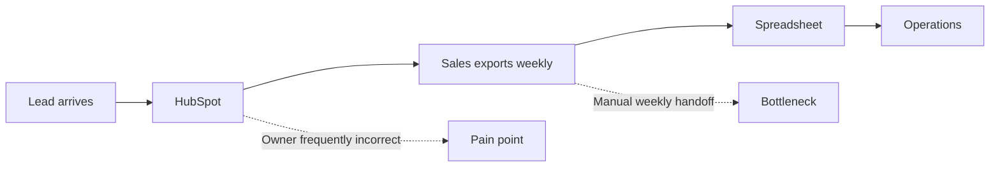

# Codex discovery thread

Source thread: `019f751e-db8d-7d82-8df4-83c524690db6`
Exported: 18 July 2026
Scope: visible user and assistant messages through the export request


---

## User

whats the best live TTS -> i speak -> words appear on screen -> that i can bundle locally into a native Mac os app


---

## Assistant

You’re describing live speech-to-text (STT), rather than TTS. I’m checking the strongest fully local, redistributable macOS options now—especially latency, accuracy, Swift integration, licensing, and bundle size.

---

## Assistant

You mean live speech-to-text (STT).

My recommendation:

### Best for a modern native Mac app: Apple `SpeechAnalyzer`

If you can target **macOS 26+**, use:

- `AVAudioEngine` for microphone capture
- `SpeechAnalyzer`
- `SpeechTranscriber`
- SwiftUI for displaying volatile and finalized text

It provides low-latency partial words, finalized transcripts, punctuation and timestamps. Recognition happens entirely on-device. Apple manages the model as a system asset, so it doesn’t inflate your app download or run inside your app’s memory allocation. [Apple’s SpeechAnalyzer overview](https://developer.apple.com/videos/play/wwdc2025/277/)

This is the cleanest “speak → words immediately appear” solution.

### If the model must ship with your app

Use **FluidAudio with a Core ML streaming model**.

My model choice would be:

- **English, maximum live accuracy:** Nemotron Speech Streaming 0.6B
- **Smallest/fastest live model:** Parakeet EOU 120M
- **European multilingual:** Nemotron Streaming Multilingual
- **Final post-recording transcription:** Parakeet TDT v3

FluidAudio is native Swift/Core ML and exposes genuinely streaming models that emit partials as audio arrives. Nemotron offers 560 ms, 1120 ms and 2240 ms latency tiers; Parakeet EOU goes as low as 160 ms. [FluidAudio model documentation](https://github.com/FluidInference/FluidAudio/blob/main/Documentation/Models.md)

One important distinction: ordinary Parakeet TDT v3 is extremely fast and accurate, but its “live” implementation uses overlapping sliding windows. It isn’t as naturally streaming as SpeechAnalyzer, Parakeet EOU or Nemotron. [FluidAudio repository](https://github.com/FluidInference/FluidAudio)

### Practical decision

- Targeting macOS 26+: **SpeechAnalyzer**
- Supporting macOS 14/15 and Apple Silicon: **FluidAudio**
- Supporting older Intel Macs too: **whisper.cpp**, although it has higher integration complexity and Whisper itself is less naturally suited to low-latency streaming. It does provide a macOS XCFramework, Metal acceleration and an MIT-licensed runtime. [whisper.cpp](https://github.com/ggml-org/whisper.cpp)

For a new app today, I’d build a `LocalTranscriptionEngine` protocol with **SpeechAnalyzer as the primary engine** and optionally FluidAudio as the fallback. That gives you the most native experience without locking the UI to one recognizer.

---

## User

rather than "press dictate" -> press finished -> transcribe via api call -> put text on screen


---

## User

sorry yes live SST.


---

## Assistant

Yes—live STT, where text appears while you’re speaking, with no “finish → upload → wait” stage.

For a native app targeting **macOS 26+**, use Apple’s `SpeechAnalyzer` + `SpeechTranscriber`:

```text
Microphone
   ↓ continuous audio buffers
SpeechAnalyzer
   ↓ partial results
SwiftUI Text view updates live
   ↓
finalized words replace partial guesses
```

It continuously returns two kinds of text:

- **Volatile text:** immediate partial guesses shown while speaking.
- **Finalized text:** stable transcription replacing the guesses.

Everything runs locally; there’s no transcription API request.

If you need **macOS 14/15**, use FluidAudio’s genuinely streaming **Parakeet EOU** or **Nemotron Streaming** model. I’d choose:

- `SpeechAnalyzer` for macOS 26+
- FluidAudio Nemotron at the 560 ms tier for older Apple Silicon Macs

That’s the correct stack for an always-listening caption-style UI, not push-to-record dictation.

---

## User

surely there's gotta be a better AI / whisper based model ?


---

## Assistant

Yes—there are stronger AI-model routes. The key wrinkle is that Whisper itself is a batch model, so most “live Whisper” apps repeatedly re-transcribe overlapping chunks. I’m separating genuinely streaming models from clever Whisper wrappers and checking what currently runs well through Core ML on a Mac.

---

## Assistant

Yes. I was too quick to make Apple’s recognizer the primary recommendation.

For **live English speech-to-text on Apple Silicon**, I’d use:

## Best choice: FluidAudio + Nemotron Speech Streaming 0.6B

Unlike Whisper, Nemotron is architected for streaming. It maintains an encoder cache and emits text continually using 80–1120 ms audio chunks. FluidAudio’s current benchmark reports roughly **2.1–2.5% WER on LibriSpeech test-clean** at the 560/1120 ms tiers. [FluidAudio benchmarks](https://github.com/FluidInference/FluidAudio/blob/main/Documentation/Benchmarks.md)

Recommended setup:

- `AVAudioEngine` captures the microphone.
- Resample to 16 kHz mono.
- Feed buffers into `StreamingNemotronAsrManager`.
- Use the **160 ms tier** for very responsive captions or **560 ms** for the better accuracy/latency balance.
- Update SwiftUI immediately with partial text.
- Finalize each phrase using end-of-utterance/VAD detection.

## Where Whisper fits

**WhisperKit + Whisper large-v3** can give excellent multilingual recognition and runs locally through Core ML. But Whisper wasn’t designed as a streaming model. “Live Whisper” repeatedly processes overlapping audio windows, which means:

- More latency
- More power usage
- Earlier words sometimes changing
- More transcript-stitching complexity

[WhisperKit](https://github.com/argmaxinc/argmax-oss-swift) supports microphone streaming and native Swift integration, but for your specific live-text experience, Nemotron is the cleaner engine.

## The strongest production architecture

Use two local models:

```text
Microphone
    ↓
Nemotron Streaming
    ↓
words appear immediately
    ↓ utterance ends
Parakeet TDT v2 or Whisper large-v3
    ↓
quietly correct/finalize that sentence
```

The second pass is optional—the user never waits for it. They see Nemotron’s output live, then perhaps get a subtle final correction.

My concrete recommendation would therefore be:

- **Live engine:** Nemotron Streaming 0.6B, 560 ms
- **Finalizer:** Parakeet TDT v2 for English
- **Swift framework:** FluidAudio
- **Minimum hardware:** Apple Silicon
- **No server or API calls**
- **Models downloadable on first launch or included inside the app package**

FluidAudio also has a smaller **Parakeet EOU 120M** streaming model with 160 ms chunks, but its documented WER is around 8% at that lowest-latency setting. Nemotron is the better quality choice. [FluidAudio streaming models](https://github.com/FluidInference/FluidAudio/blob/main/Documentation/Models.md)

---

## User

if i wanted to accurately transcribe a call live, lets say the call was to happen on meet / zoom etc
what would be the best way to do that? Im thinking if we could leverage some existing screen / streaming software such as OBS? what options do we have.

basically the idea is this

stream a live call with several participants -
participants introduce themselves
an agent now has context about who is who
then the conversation begins
the conversation is streamed, we start to build a picture of the discussion and then we also start to build a picture of the point of view of each participant


---

## Assistant

This is a different—and much more interesting—problem than ordinary dictation. The hard part isn’t transcription; it’s capturing clean meeting audio and keeping speaker identity stable through interruptions and overlap. I’m checking the current native macOS, Zoom/Meet, OBS-routing, and meeting-bot options before recommending an architecture.

---

## Assistant

Yes—but for accurate multi-person calls, the decisive factor is not the transcription model. It’s whether you can obtain a separate audio stream for each participant.

If you have separate streams, you already know who spoke. If you capture one mixed Zoom/Meet output, even excellent transcription still needs fallible speaker diarization.

## Best architecture

```text
Meeting platform
    ↓ separate audio stream per participant
Participant ID + name
    ↓
Streaming STT per participant
    ↓
Timestamped utterance events
    ↓
Evidence-backed participant profiles
    ↓
Rolling discussion model
```

Each utterance should become something like:

```json
{
  "speaker_id": "zoom:19778240",
  "speaker_name": "Sarah",
  "started_at": 184.2,
  "ended_at": 191.7,
  "text": "I’m worried the launch date is too aggressive.",
  "is_final": true,
  "confidence": 0.94
}
```

The analysis agent then maintains separate layers:

- What Sarah explicitly said
- Sarah’s apparent position, with confidence
- Concerns and objections
- Proposals and preferences
- Commitments and actions
- Changes or contradictions over time
- Supporting utterances and timestamps

That separation matters: “Sarah said X” is evidence; “Sarah opposes the project” may only be an inference.

## Capture options

| Route | Speaker accuracy | Platforms | Verdict |
|---|---:|---|---|
| Zoom RTMS | Excellent | Zoom | Best production route for Zoom |
| Meet Media API | Excellent | Meet | Promising, but currently Developer Preview |
| Teams media bot | Excellent | Teams | Powerful but operationally complex |
| Meeting-bot provider | Usually excellent | Zoom/Meet/Teams | Fastest cross-platform MVP |
| macOS ScreenCaptureKit | Moderate | Anything playing on Mac | Best private/local MVP |
| OBS capture | Moderate | Anything OBS captures | Useful prototype tool, not ideal product architecture |

### Zoom: RTMS is the gold-standard route

Zoom RTMS can deliver:

- Separate 16 kHz PCM audio for each participant
- Participant ID and display name with every stream
- 20 ms audio packets
- Zoom’s own live transcript, already attributed
- Mixed audio if you also need recording/playback

That eliminates most diarization uncertainty. You can run your own Nemotron/Parakeet STT on every participant stream or begin with Zoom’s attributed transcript. [Zoom RTMS media documentation](https://developers.zoom.us/docs/rtms/meetings/media/)

Introductions then enrich identity—role, company, interests—but do not determine which voice belongs to which person. Zoom’s participant metadata already does that.

### Google Meet

Google now has a real-time Media API providing audio, video and participant metadata. Audio sources can be associated with participant records. However, it is currently a Developer Preview and requires the project, OAuth principal and all meeting participants to be enrolled, making it unsuitable for a general product today. [Google Meet Media API](https://developers.google.com/workspace/meet/media-api/guides/overview)

### Microsoft Teams

Teams supports application-hosted media bots with frame-level access to live meeting audio, video and screen sharing. It is capable, but Microsoft describes it as an advanced integration that can involve managed-partner or certification requirements. [Teams real-time media](https://learn.microsoft.com/en-us/microsoftteams/platform/bots/calls-and-meetings/real-time-media-concepts)

### Cross-platform shortcut

A meeting-bot provider such as Recall.ai can join Zoom, Meet and Teams and send separate participant audio over WebSocket. This is probably the quickest way to test whether the product concept is valuable before building three platform integrations. [Recall separate participant audio](https://docs.recall.ai/docs/how-to-get-separate-audio-per-participant-realtime)

The tradeoff is obvious: audio leaves the Mac and you inherit another company’s privacy, reliability and pricing constraints.

## Native Mac route

For a private, local-first Mac application, use **ScreenCaptureKit**, not OBS.

ScreenCaptureKit can capture audio from a selected application—Zoom, Chrome, Teams—as `CMSampleBuffer`s. Capture the microphone separately with `AVAudioEngine`. [Apple ScreenCaptureKit](https://developer.apple.com/documentation/screencapturekit)

The pipeline would be:

```text
Zoom/Chrome application audio ─┐
                               ├─ timestamped meeting timeline
Local microphone ──────────────┘
             ↓
Nemotron Streaming STT
             ↓
LS-EEND or Sortformer diarization
             ↓
speaker enrolment from introductions
```

This is completely local and platform-independent, but remote participants generally arrive as one mixed stream. You therefore need diarization.

FluidAudio currently offers:

- **LS-EEND:** default live diarizer, up to ten speakers
- **Sortformer:** more stable identities, but limited to four speakers
- Speaker pre-enrolment from introduction samples
- Tentative and finalized speaker segments

[FluidAudio diarization](https://github.com/FluidInference/FluidAudio)

Introductions can bind an anonymous diarization cluster to a name:

1. UI asks Alex to introduce themselves.
2. Capture that isolated speech segment.
3. Associate its speaker embedding/slot with Alex.
4. Continue matching subsequent turns to Alex.
5. Allow the mapping to be corrected manually.

It will still fail occasionally with similar voices, interruptions, poor microphones and overlapping speech. FluidAudio itself cautions that live diarization is materially less accurate than offline diarization.

## Where OBS fits

OBS is good for proving the capture pipeline:

- It can capture all desktop audio or a specific macOS application.
- It can record mic and application audio as different tracks.
- It provides excellent visual monitoring and level controls.

[OBS macOS audio capture](https://obsproject.com/kb/macos-desktop-audio-capture-guide)

I would not make it a production dependency. You would need a virtual audio route, custom OBS plugin or intermediary stream to move PCM into your app; it adds installation friction and usually gives you the same mixed participant audio that ScreenCaptureKit can capture directly.

## My recommendation

For validating the product:

1. Build the intelligence layer against **Zoom RTMS** or Recall’s separate-participant streams.
2. Prove that the rolling participant-position model is genuinely useful.
3. Add the **native ScreenCaptureKit local mode** as the private, works-with-any-call option.
4. Treat diarization-based identity as an explicitly lower-confidence fallback.
5. Store every inferred viewpoint with supporting transcript timestamps.
6. Make recording/transcription visible and require explicit participant consent.

The strongest product could offer two modes:

- **Connected meeting:** exact participant attribution through Zoom/Meet/Teams integration.
- **Private local capture:** no bot joins, everything stays on the Mac, but speaker attribution carries confidence and may require correction.

---

## User

the zoom RTMS would only work with zoom meetings itself?


---

## Assistant

Correct. **Zoom RTMS only works with meetings running on Zoom’s infrastructure**—Zoom Meetings, Zoom Webinars, Zoom Contact Center and Zoom Video SDK sessions.

It cannot capture:

- Google Meet
- Microsoft Teams
- FaceTime
- Discord
- Calls running in an arbitrary browser or Mac application

For a platform-independent Mac app, your realistic choices are:

- **ScreenCaptureKit:** Capture audio from Zoom, Chrome, Teams or another selected Mac app. Fully local, but remote speakers generally arrive as one mixed stream.
- **Meeting-bot provider:** Recall.ai or similar joins Zoom, Meet and Teams and provides participant-attributed audio. Cross-platform, but cloud-based.
- **Separate native integrations:** Zoom RTMS + Google Meet Media API + Microsoft Teams media bot. Best participant attribution, but considerable integration work.

The sensible product architecture is therefore:

```text
Platform integration available?
    ├─ Yes → separate participant streams and reliable identities
    └─ No  → ScreenCaptureKit mixed audio + local diarization
```

So Zoom RTMS is the best **Zoom capture adapter**, not the universal capture foundation. For a universal native Mac product, ScreenCaptureKit would be the foundation, with RTMS and other platform integrations added as higher-accuracy adapters.

---

## User

this is for a hackathon, so it needs to be an mvp we can ship in <3h


---

## Assistant

That changes the answer completely: don’t spend the hackathon building audio infrastructure. The demo’s value is the live “who believes what” model, so I’m narrowing this to the shortest reliable path that preserves participant identity.

---

## Assistant

For a sub-3-hour hackathon build, use **Recall.ai** and drop OBS, ScreenCaptureKit, local Whisper, diarization and platform-specific APIs.

The hackathon value is the live participant-understanding agent—not audio capture infrastructure.

## MVP architecture

```text
Meeting URL
   ↓
Recall bot joins Zoom / Meet / Teams
   ↓
Live attributed transcript events
   ↓
Small backend
   ↓
LLM updates participant viewpoints
   ↓
Live dashboard
```

Recall can send `transcript.data` events containing participant names and timestamps. Enable separate-stream diarization when available:

```json
{
  "meeting_url": "MEETING_URL",
  "bot_name": "Discussion Observer",
  "recording_config": {
    "transcript": {
      "provider": {
        "recallai_streaming": {
          "mode": "prioritize_low_latency",
          "language_code": "en"
        }
      },
      "diarization": {
        "use_separate_streams_when_available": true
      }
    },
    "realtime_endpoints": [{
      "type": "webhook",
      "url": "https://YOUR_PUBLIC_URL/transcript",
      "events": [
        "transcript.data",
        "participant_events.join",
        "participant_events.speech_on",
        "participant_events.speech_off"
      ]
    }]
  }
}
```

[Recall real-time transcription documentation](https://docs.recall.ai/docs/bot-real-time-transcription)

## What to build

One screen:

- Meeting URL input
- “Join meeting” button
- Live attributed transcript
- Participant cards
- Discussion state

Each participant card contains:

```json
{
  "name": "Sarah",
  "role": "Product lead",
  "stated_positions": [],
  "likely_viewpoint": "",
  "concerns": [],
  "proposals": [],
  "commitments": [],
  "confidence": 0.0,
  "evidence_utterance_ids": []
}
```

During introductions, the agent fills in roles and context. Recall already knows which meeting participant produced each utterance, so introductions are not needed for voice identification.

Every 10–15 seconds—or after a meaningful speaker turn—send the new utterances plus current state to a fast LLM and request a JSON patch. Don’t resend the entire transcript repeatedly.

## Three-hour allocation

1. **0–30 minutes:** Recall account, API call and test bot joining a meeting.
2. **30–75 minutes:** Receive attributed transcript events through a public webhook using Cloudflare Tunnel or ngrok.
3. **75–135 minutes:** Live dashboard with transcript and participant cards.
4. **135–165 minutes:** LLM state updater for positions, tensions, agreements and actions.
5. **165–180 minutes:** Rehearse a scripted three-person meeting and fix presentation failures.

## Ruthlessly exclude

Do not build:

- OBS integration
- Native audio capture
- Local STT
- Speaker diarization
- Voice enrolment
- Video processing
- Persistent accounts
- Calendar integration
- Multiple meeting integrations yourself

For the demo, have three participants introduce themselves, deliberately disagree on one decision, gradually converge and assign an action. The dashboard should visibly evolve from identity → positions → tension → consensus → commitment.

The main operational risk is the bot being stuck in the waiting room, so ensure the host admits **Discussion Observer** before presenting.

---

## User

recall will work with live ?


---

## Assistant

Yes. Recall works during a live Zoom, Google Meet or Microsoft Teams call.

The flow is:

1. Give Recall the live meeting URL.
2. Its bot joins as a visible participant.
3. The host admits it if there’s a waiting room.
4. Recall sends transcript utterances to your webhook/WebSocket while people are speaking.
5. Each event includes the participant identity, words and timestamps.
6. Your UI and analysis agent update during the meeting.

Use this configuration:

```json
"provider": {
  "recallai_streaming": {
    "mode": "prioritize_low_latency",
    "language_code": "en"
  }
},
"diarization": {
  "use_separate_streams_when_available": true
}
```

Subscribe to:

```json
[
  "transcript.data",
  "participant_events.join",
  "participant_events.speech_on",
  "participant_events.speech_off"
]
```

Recall documents this specifically as live transcription for meeting bots, delivered continuously through webhooks or WebSockets. [Recall live transcription](https://docs.recall.ai/docs/bot-real-time-transcription)

Important caveats:

- The Recall bot appears in the meeting—it isn’t invisible.
- Someone may need to admit it.
- There will be some transcription latency, but it is intended for live agent experiences.
- Create the bot before the demo where possible; Recall warns that last-minute ad-hoc bots can occasionally return capacity errors.
- Participants should be told that transcription/analysis is active.

So yes: this is suitable for your hackathon’s live evolving participant cards and discussion map.

---

## User

so we are thinking of a native mac app, which also will stream context into codex app server


---

## Assistant

That makes sense: the Mac app becomes the live meeting surface and Codex app-server becomes the reasoning runtime. I’m using the `codex-app-server` integration guidance here because the crucial design choice is how to feed incremental meeting state without turning every transcript fragment into a new conversational turn.

---

## Assistant

The skill’s guidance confirms this should be a real app-server client, not a one-shot SDK wrapper. I’m checking the lifecycle and transport details now so the hackathon version stays small but doesn’t paint us into a corner.

---

## Assistant

Yes—that’s a coherent hackathon architecture. The native Mac app is the live product surface; Recall supplies attributed meeting events; Codex app-server maintains the reasoning thread.

```text
Zoom / Meet / Teams
        ↓
   Recall bot
        ↓ live attributed transcript
 Public webhook
        ↓
 Local Node bridge
   ├──→ SwiftUI Mac app
   └──→ codex app-server over stdio
```

For under three hours, I would use a tiny Node bridge rather than implement the Recall webhook receiver and full JSON-RPC client directly in Swift. The UI remains genuinely native.

## Codex interaction

Create **one Codex thread per meeting**:

1. Launch `codex app-server` as a local child process.
2. Send `initialize`, followed by `initialized`.
3. Call `thread/start`.
4. Buffer finalized transcript utterances.
5. Every 5–10 seconds, call `turn/start` with only the new utterances.
6. Request structured JSON using `outputSchema`.
7. Update the Mac UI only after the resulting item/turn completes.
8. Send one final turn when the meeting ends.

App-server explicitly supports persistent threads, structured turn output and streamed agent events. [`turn/start` and app-server protocol](https://learn.chatgpt.com/docs/app-server#start-a-turn)

Don’t send every partial word to Codex. Show partial transcription immediately in the UI, but only send completed speaker turns:

```json
{
  "meeting_id": "demo-1",
  "sequence": 42,
  "utterances": [
    {
      "id": "u-42",
      "participant": "Sarah",
      "text": "I think we should delay launch by two weeks.",
      "started_at": 184.2,
      "ended_at": 189.8
    }
  ]
}
```

Codex returns:

```json
{
  "participants": [{
    "name": "Sarah",
    "role": "Product lead",
    "position": "Prefers delaying launch",
    "concerns": ["Quality risk"],
    "commitments": [],
    "confidence": 0.91,
    "evidence": ["u-42"]
  }],
  "discussion": {
    "current_question": "Whether to delay launch",
    "agreements": [],
    "tensions": ["Speed versus quality"],
    "open_questions": [],
    "actions": []
  }
}
```

While a Codex turn is running, queue incoming utterances locally and send them in the next turn. Don’t complicate the MVP with `turn/steer`.

## The Mac app

One window with:

- Meeting URL and “Join” button
- Connection status for Recall and Codex
- Live transcript column
- Participant cards
- Current agreements and tensions
- Actions and unresolved questions

For safety, run the meeting thread against an empty scratch directory with read-only sandboxing and no approvals. This agent only needs to reason over text; it shouldn’t edit files or execute commands.

That is the version I’d build: **SwiftUI UI + tiny local Node relay + Recall + one real Codex app-server thread**. It demonstrates the product idea without spending the hackathon rebuilding meeting capture or speaker identification.

<oai-mem-citation>
<citation_entries>
MEMORY.md:1980-1992|note=[reused prior real-state Codex app-server client lessons]
</citation_entries>
<rollout_ids>
019f1ed9-6716-7ac0-bed2-28acba556e06
</rollout_ids>
</oai-mem-citation>

---

## User

the current mvp is here: 019f74f9-517b-7ff1-8117-ff903fea53b6
identify how far we are away from this type of reality with a subagent, whilst we continue chatting here


---

## Assistant

I’ll send a subagent to inspect that Codex task’s actual current state and compare it against the live-call → attributed transcript → Codex reasoning → participant-viewpoint experience we’ve defined. It’ll report concrete gaps, blockers, and the shortest path while we keep this conversation free.

---

## Assistant

The subagent is now auditing task `019f74f9-517b-7ff1-8117-ff903fea53b6` read-only against the full live-meeting target.

It will report:

- What genuinely works now
- What is mocked, partial or unverified
- Missing Recall and Codex app-server pieces
- UI/state-model gaps
- Concrete blockers
- Fastest credible hackathon path and estimated slices

We can keep working through the product decisions here meanwhile.

---

## User

so the main thought that we have for this product is this scenario:

a builder (or consultant builder, FDE etc) will have a conversation with a stakeholder (think CEO / CTO)

CEO will ramble about his pain points with business or frustrations

we will stream the conversation into codex, which should automatically infer speakers, and separate topics, and. the KEY PART: is to create diagrams of the target business in terms of their workflows etc


---

## Assistant

That sharpens the product considerably: the primary artifact is not a transcript or participant profile—it is a live, evidence-backed model of how the stakeholder’s business operates. I’m updating the audit subagent so it measures the current MVP against that diagram-first reality.

---

## Assistant

Exactly. The real product is not “AI meeting notes.” It is a **live discovery architect**:

> A stakeholder talks naturally, and an operating model of their business materializes while they speak.

The transcript is merely the evidence stream.

## Core experience

During the conversation, the app continuously builds:

- Actors and teams
- Existing systems and tools
- Business processes
- Inputs and outputs
- Manual handoffs
- Decision and approval points
- Bottlenecks and frustrations
- Data movement
- Current-state workflows
- Desired outcomes
- Candidate future-state workflows
- Unknowns requiring clarification

The diagram should visibly evolve during the call.

For example, the CEO says:

> “Leads arrive in HubSpot, but sales exports them every Friday and sends a spreadsheet to operations. Half the time the owner field is wrong.”

The app adds:



## The crucial truth distinction

Stakeholder rambling will reveal the current business much more reliably than the desired business. Therefore, the product must distinguish:

- **Stated current state**
- **Explicit desired state**
- **Codex-inferred hypothesis**
- **Unknown or contradictory information**

Visually:

- Solid nodes/edges: explicitly stated
- Red markers: stated pain points
- Dashed lines: inferred relationships
- Purple nodes: proposed future state
- Grey nodes: unresolved questions

Otherwise, the diagram will look convincing while quietly hallucinating the business.

## Canonical graph

Codex should return structured graph patches—not merely a fresh Mermaid string each time:

```json
{
  "topic": "Lead management",
  "operations": [
    {
      "op": "upsert_node",
      "node": {
        "id": "system-hubspot",
        "type": "system",
        "label": "HubSpot",
        "status": "current",
        "confidence": 1.0,
        "evidence": ["u-104"]
      }
    },
    {
      "op": "upsert_edge",
      "edge": {
        "id": "hubspot-to-sales-export",
        "from": "system-hubspot",
        "to": "process-weekly-export",
        "type": "feeds",
        "status": "current",
        "confidence": 0.96,
        "evidence": ["u-104"]
      }
    }
  ],
  "questions": [
    {
      "text": "What does operations do with the spreadsheet?",
      "reason": "The downstream workflow is currently unknown."
    }
  ]
}
```

The Mac app owns the canonical graph and renders it as Mermaid. Codex proposes patches; it does not replace the whole diagram every few seconds.

## Speaker handling

With Recall, Codex should not infer the speaker from audio. Recall supplies participant identity.

Codex should infer:

- Their role
- Their responsibilities
- Their authority
- Which workflows they understand
- Whether their statement is observation, frustration, requirement or speculation

For a two-person MVP:

- Builder/FDE
- Stakeholder

That is enough. Multi-speaker voice inference can wait.

## Killer feature: live follow-up questions

As Codex constructs the model, it should identify the most valuable missing relationship:

> “You’ve established that sales sends the spreadsheet to operations, but not what operations does next. Ask: ‘What happens when operations receives it?’”

That makes the app an active discovery partner, not a passive visualization tool.

## Hackathon scope

Build only:

1. Live attributed transcript
2. One evolving **current-state workflow diagram**
3. Red pain-point overlays
4. Clickable nodes showing the supporting quote
5. A “Suggested next question” card
6. A toggle revealing a lightly inferred future-state diagram

Exclude multiple diagram formats, complex layouts, automatic code generation and perfect organizational modelling.

The demo moment should be:

> CEO starts with a messy complaint → disconnected nodes appear → relationships form → pain points attach → the app spots a missing step → builder asks the suggested question → workflow completes → a candidate future state appears.

That is a much stronger product than meeting summaries.

---

## User

start another subagent - for the purposes of this mvp, compare the capabilities of recall.ai vs openai's realtime STT solutions


---

## Assistant

I’ll run a separate, current-source comparison focused specifically on this three-hour MVP: Recall’s meeting capture and participant attribution versus OpenAI’s Realtime transcription capabilities, including what each does—and does not—solve before audio reaches Codex.

---

## Assistant

The second subagent is now comparing Recall.ai against OpenAI Realtime STT for this exact MVP.

It will separately assess:

- Meeting capture versus transcription
- Zoom, Meet and Teams support
- Participant names and separate audio streams
- Diarization accuracy
- Live partial/final transcript behaviour
- Latency and language support
- Native Mac integration requirements
- Webhook/WebSocket complexity
- Privacy and current pricing
- Whether a hybrid—Recall capture plus OpenAI STT—is viable
- Which route can credibly work within three hours

Both audits are running independently.

---

## User

i also want to think about this potential solution:

imagine codex joins as an actual participant to the call - and shares its screen. the screen itself is a blank white page.

as the conversation develops, codex will automatically draw diagrams onto the whiteboard. so basically its like a conversation aware, smart whiteboard


---

## Assistant

That is a substantially better demo: the agent is no longer a hidden analyst—it becomes a visible facilitator whose canvas evolves in the meeting. I’m checking the shortest supported way to make the bot display the whiteboard, because a bot camera feed may achieve the same effect far faster than automating literal screen sharing.

---

## Assistant

Yes—this is the strongest version of the idea.

Technically, a **Recall bot joins as the participant**, while Codex acts as its brain. Recall can stream a live webpage into the meeting through either the bot’s camera or an actual screenshare. Whatever the webpage renders becomes visible to participants. This works across Zoom, Google Meet and Teams. [Recall Output Media](https://docs.recall.ai/docs/stream-media)

```text
Participants speak
        ↓
Recall live attributed transcript
        ↓
Codex extracts BusinessGraphPatch
        ↓
Shared graph state updates
        ↓
Whiteboard webpage redraws
        ↓
Recall streams webpage into meeting
```

## The meeting experience

A participant called **Live Architect** joins.

Its shared screen begins as:

```text
Understanding your business…
```

As the CEO talks:

1. Actors and systems appear.
2. Connections form between them.
3. Manual steps become visible.
4. Pain points attach to relevant steps.
5. Unknown areas appear as questions.
6. Explicit desired outcomes appear.
7. A proposed future-state layer gradually emerges.

The bot remains silent. Its contribution is the shared visual model.

## This is supported directly

Your Create Bot request can include:

```json
{
  "meeting_url": "MEETING_URL",
  "bot_name": "Live Architect",
  "output_media": {
    "screenshare": {
      "kind": "webpage",
      "config": {
        "url": "https://YOUR_APP/whiteboard/MEETING_TOKEN"
      }
    }
  }
}
```

Recall renders that webpage at 1280×720 and streams it into the meeting. It can use either:

```json
"output_media": {
  "screenshare": { "...": "..." }
}
```

or:

```json
"output_media": {
  "camera": { "...": "..." }
}
```

[Recall Output Media API](https://docs.recall.ai/reference/bot_output_media_create)

## Camera versus screenshare

For the hackathon:

- **Screenshare:** Best visual impact and allows participants to enlarge the diagram, but meeting permissions must allow the bot to share.
- **Camera feed:** More reliable because it behaves like the bot turning on its camera. Ask the host to pin or spotlight the bot.

I would configure screenshare for the scripted demo and keep camera mode as the fallback.

## Whiteboard implementation

Don’t make Codex draw pixels. Have it emit structured graph operations:

```json
{
  "operations": [
    {
      "op": "add_node",
      "id": "manual-export",
      "type": "process",
      "label": "Sales exports leads weekly"
    },
    {
      "op": "add_edge",
      "from": "hubspot",
      "to": "manual-export",
      "type": "feeds"
    },
    {
      "op": "add_pain",
      "target": "manual-export",
      "label": "Slow and error-prone"
    }
  ]
}
```

The whiteboard webpage applies those patches and renders Mermaid.

Use gentle animations so nodes don’t jump violently whenever the model updates. Update after a complete thought or every 10–15 seconds—not on every word.

## Two surfaces, one state

The Mac app and meeting whiteboard should display different views of the same graph:

**Meeting screenshare**

- Clean workflow diagram
- Large typography
- Pain points
- Current topic
- Minimal text

**Builder’s Mac app**

- Transcript
- Supporting quotes
- Confidence levels
- Suggested follow-up question
- Approve/reject inferred nodes
- Current-state/future-state controls

That means the stakeholder sees the evolving shared understanding, while the builder retains the diagnostic controls.

## Three-hour MVP

Build:

1. One hosted whiteboard webpage.
2. Recall bot configured with webpage screenshare.
3. Live transcript events.
4. One Codex thread producing graph patches.
5. Mermaid rendering.
6. Mac app showing the same webpage plus transcript.

Skip drag-and-drop editing, freehand drawing, multiple canvases and voice responses.

The killer demo is not that Codex produces a diagram afterward. It is that the CEO watches their messy explanation crystallize into a shared operating model in real time—and corrects it as it forms.

---

## User

ask the recall v openai stt subagent - what about gpt 4o diarize


---

## Assistant

I’ll run a focused follow-up on `gpt-4o-transcribe-diarize`: whether it changes the Recall-versus-OpenAI conclusion for live meetings, especially its streaming behaviour, speaker labels, participant names, and suitability within the three-hour MVP.

---

## Assistant

The focused subagent is checking `gpt-4o-transcribe-diarize` now.

The critical question is whether it provides genuinely live, stable speaker attribution—or merely anonymous diarized segments from mixed audio. It will compare:

- Recall’s participant-attributed transcript
- Recall mixed audio → GPT-4o diarization
- Recall separate participant streams → OpenAI transcription per stream

It’ll also verify whether the diarization model works through OpenAI Realtime or only the transcription endpoint.

---

## User

im wondering whether mac app is too slow to build


---

## Assistant

Yes. For a three-hour hackathon, the native Mac app is probably unnecessary scope.

Recall’s visual-output feature already requires a **webpage**, so make that webpage the product:

```text
Node/TypeScript server
├── Recall webhook/API integration
├── Codex app-server child process
├── Shared meeting state
├── /operator/:meeting
└── /whiteboard/:meeting
```

- `/operator` is the builder’s dashboard: transcript, evidence, suggested questions and controls.
- `/whiteboard` is the clean diagram Recall shares into the meeting.
- Both receive the same state through WebSocket.
- Cloudflare Tunnel or ngrok exposes the local server to Recall.
- Node communicates with Codex app-server over stdio.

This eliminates:

- Xcode project setup
- Swift JSON-RPC implementation
- Signing and entitlements
- Native networking complications
- SwiftUI diagram rendering
- WKWebView bridging
- Building two versions of the whiteboard

You can make `/operator` look like a polished desktop application and run it in a dedicated browser window. If there is spare time, wrap it afterward with Electron or Tauri—but don’t begin there.

My recommendation:

> Build one TypeScript web application first. Recall streams its whiteboard route into the meeting, while the builder controls it through the operator route.

The core demo remains fully real. A native shell adds almost no value to the hackathon moment.

---

## User

costs for recall - lets say for a 5 minute meeting where we stream and we diarize participants and tke in the whole conversation


---

## Assistant

I’ll calculate the current all-in cost for a five-minute meeting, separating the bot/media charge from real-time transcription and separate-stream diarization, because Recall prices those components differently.

---

## Assistant

For a five-minute meeting with Recall’s live transcription and separate-stream “perfect diarization,” the estimated cost is approximately **$0.064—about 6.4 cents**.

| Component | Hourly price | Five-minute cost |
|---|---:|---:|
| Recall meeting bot/recording | $0.50/hour | $0.0417 |
| Live transcription with perfect diarization | ~$0.27/hour | ~$0.0225 |
| **Estimated total** | **~$0.77/hour** | **~$0.0642** |

The transcription calculation uses Recall’s $0.15/hour rate multiplied by the documented approximate **1.8× usage** for real-time separate-stream diarization. [Recall pricing](https://www.recall.ai/pricing), [diarization pricing](https://docs.recall.ai/docs/diarization)

A few useful details:

- Participant count does not affect the base recording price.
- Billing is prorated to the second.
- Webhook/WebSocket events do not have an additional per-request charge.
- Seven days of recording storage are included.
- The first five recording hours are currently free for new Pay As You Go accounts. Whether all transcription usage is covered depends on the credits applied to the account.

### With the live whiteboard

If Recall requires the `web_4_core` bot for smooth webpage output, that adds $0.10/hour:

```text
Five-minute 4-core surcharge: $0.0083
Estimated meeting total:      $0.0725
```

So the complete hackathon experience—bot, live attributed transcript, diarization and shared whiteboard—should cost roughly **6–8 cents for five minutes**, excluding Codex/OpenAI reasoning costs. [Recall bot variant pricing](https://docs.recall.ai/docs/calculating-usage)

The GPT-4o diarization follow-up also concluded that it wouldn’t reduce this MVP cost meaningfully: `gpt-4o-transcribe-diarize` is not a true live-input Realtime model and only assigns anonymous speaker labels unless you pre-enrol voices. Recall’s participant-attributed streams remain the right live path.

---

## User

okay - locked in then

recall
/operator +  /whiteboard endpoints

lets come up with a base PRD and then we can refine further from there


---

## Assistant

Locked. I’m turning the decisions into a concise v0.1 PRD before any more implementation: Recall for meeting capture, `/operator` for the builder, `/whiteboard` for the in-call canvas, and Codex app-server for evidence-backed graph updates. I’m reusing the app-server client contract so the PRD reflects a buildable lifecycle rather than a generic “send text to AI” box.

---

## Assistant

The base shape is now clear. I’m writing the PRD around one decisive demo loop: stakeholder speech becomes attributed evidence, Codex converts it into graph patches, and the same state updates both the builder’s operator view and the whiteboard being shared inside the call.

---

## Assistant

The base PRD is ready: [Live Architect — Base PRD](/Users/stephenparker/Documents/Codex/2026-07-18/whats/outputs/live-architect-base-prd.md)

It locks:

- Recall.ai meeting capture and attribution
- `/operator/:sessionId` and `/whiteboard/:sessionId`
- Recall screenshare with camera fallback
- Codex app-server lifecycle
- Evidence-backed graph patches
- Current-state versus inferred future-state visuals
- Canonical graph schema
- Five-minute demo acceptance criteria
- Strict three-hour implementation sequence
- Failure handling and scripted demo

The highest-value decisions to refine next are:

1. Zoom-only for the demo, or Meet too?
2. Screenshare or the more reliable pinned camera feed?
3. Should inferred future-state changes appear automatically or require builder approval?

---

## User

the new (empty) project repo is gonna be [sergiopesch/scoutv2](https://github.com/sergiopesch/scoutv2)
we can create a new project folder in codex and pin it


---

## Assistant

I’ll create a real local checkout under the Codex projects folder, then create a repo-scoped Codex task for it, title it “Scout v2,” and pin that task so the project appears in the sidebar. I’ll verify the target path first to avoid colliding with an existing checkout.

---

## Assistant

The repository is now cloned at the intended Codex project path. I’m verifying its git state and checking whether Codex has registered it as a selectable project before creating and pinning the repo-scoped task.

---

## Assistant

Codex has not auto-registered the fresh checkout yet, so it cannot be targeted by the thread-creation API. I’m using the Mac UI control path for the one missing step—adding the folder as a Codex project—then I can create and pin the task through the proper task tools.

---

## Assistant

The Codex UI blocks automation of its own window, so I can’t click “Add project” directly. I’m checking the supported local CLI/project-registration path instead; the checkout itself is already clean and ready.

---

## User

can we export this thread and send it to someone else so they can see this thread history


---

## Assistant

Yes—likely either as a shareable task link or an exported transcript, depending whether you want them to view it in Codex or receive a static document. I’m checking the current Codex sharing/export options rather than guessing, while the Scout v2 task finishes registering.

---

## User

i want them to open it in codex


---

## Assistant

Understood—you want a handoff they can open as an actual Codex task, not a read-only web snapshot. I’m checking whether Codex currently supports cross-account task sharing/import; if it doesn’t, I’ll give you the closest reliable repo-based handoff that recreates the full context inside their Codex project.

---

## User

including the artifacts


---

## Assistant

Including the artifacts, yes—but not as the exact same native Codex thread.

The reliable handoff is a portable bundle committed to `scoutv2` containing:

- Full conversation transcript
- Live Architect PRD
- Diagrams, screenshots, and generated artifacts
- Decision log and architecture summary
- `START_HERE.md` with a bootstrap prompt for Codex
- Machine-readable session context where useful

They would clone the repository, run:

```bash
codex app /path/to/scoutv2
```

Then paste the bootstrap prompt. Codex would see the entire history and artifacts inside a new task. It won’t preserve this exact task ID or recreate the original chat bubbles.

A ChatGPT shared link is only a read-only snapshot and doesn’t provide this Codex-project handoff workflow. [OpenAI shared links FAQ](https://help.openai.com/en/articles/7925741-chatgpt-shared-links-faq)

I can assemble that handoff pack in `scoutv2` next. I’ll leave pushing to GitHub until you explicitly approve it.

<oai-mem-citation>
<citation_entries>
MEMORY.md:620-622|note=[used prior Codex task recovery and visibility behavior]
</citation_entries>
<rollout_ids>
019f6a0d-aa87-7de1-8d4b-e7a53179d9fc
</rollout_ids>
</oai-mem-citation>

---

## User

ok you can create a branch and push this artifact there now
